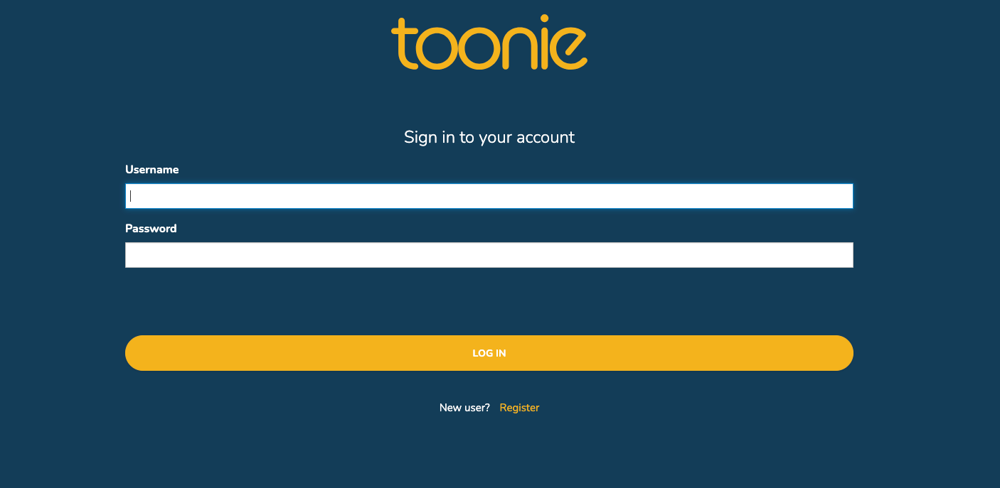

# Introduction
This constitutes the official documentation of the "Pay with Toonie" acquiring solution.

This guide will allow you to integrate your stores and ecommerces with Toonie's acquiring service in just three simple steps, facilitated by our **Pay-with-Toonie Checkout** experience.


# Checkout Experience Integration

In its current implementation the integration requires just few minutes to go from 0 to fully integrated to Toonie and start receiving your first payment.

The current flow relies on just one simple API call to setup your payment request and will take care of your customer experience until the payment is completed!

The Checkout Experience will allow you to acquire payments in just three steps:

1. Authentication
2. Payment Session Creation
3. Customer Checkout Redirection
4. How to validate a payment status


## 1. Authentication

In order to communicate with the API, it is necessary to perform first:

Go to [Toonie Developer Portal](WE NEED SOME URL HERE) and generate your token, after that the next step is login to the API:



It will generate a token and code that you will need to use in the next step.


```js
// Auth to get token
const tokenRes = await fetch("https://<ENVIRONMENT_AUTH_URL>/auth/realms/toonie/protocol/openid-connect/token", {
    method: "POST",
    headers: {
        "content-type": "application/x-www-form-urlencoded",
    },
    body: new URLSearchParams({
        "grant_type": "authorization_code",
        "client_id": "paywithtoonie-client",
        "code": "<CODE>"
    })
});
```

>*Note: Authentication via a combination of `APIKey/APISecret` and via `Developer Tokens` currently being developed.*

This will return an Authentication Token that will have to be added to the Payment Session Creation request.

## 2. Payment Session Creation

To complete the initialization of a new payment session you need to call the endpoint to create it, passing some parameters like an amount, a currency and a reason.

You also need to pass a success and an error url parameters where the user will be sent after the payment.

>You can use the `{PAYMENT_SESSION_ID}` placeholder anywhere in your URLs or query string: it will be replaced with the right value by our systems.
>
> e.g. `https://myecommerce.com/payments/{PAYMENT_SESSION_ID}/ok` will be translated to
`https://myecommerce.com/payments/ABCDEFG/ok`


```js
// Create a payment session
const createPaymentSession = async (amount, currency, reason) => {
  const tokenData = await getTokenData();

  const res = await fetch("https://<ENVIRONMENT_API_URL>/acquiring/v1/payment", {
    method: "POST",
    headers: {
      Authorization: `Bearer ${tokenData.access_token}`,
      "content-type": "application/json",
    },
    body: JSON.stringify({
      "amount": amount,
      "currency": currency,
      "reason": reason,
      "successUrl": "<SUCCESS_PAGE_URL>",
      "errorUrl": "<ERROR_PAGE_URL>",
    })
  })

  const data = await res.json();

  return {
      paymentSessionId: data.sessionId,
      status: data.status,
      amount: data.amount,
      currency: data.currency,
      successUrl: data.successUrl,
      errorUrl: data.errorUrl,
      reason: data.reason,
      merchantDisplayName: data.displayName,
      providers: data.selectedProviders
  };
};
```

## 3. Customer Checkout Redirection

Once obtained a Payment Session ID, you will just need to redirect your customer at the following URL:
```
https://<CHECKOUT_APP_URL>/?orderId={PAYMENT_SESSION_ID}
```

Example:
```
https://pay.toonieglobal.com/?orderId=ABCDEFG
```

The Toonie Checkout experience will then guide your customer to payment completion, redirecting them back to the specified success/failure URLs accordingly at the end of the process.

## 4. How to validate a payment status

To check the status of a payment, you can call the following endpoint, where you can list all the payment sessions created by your merchant account.

```js

const listPaymentSessions = async () => {
  const tokenData = await getTokenData(); // Reuse token logic from the authentication step

  const res = await fetch("https://<ENVIRONMENT_API_URL>/acquiring/v1/payment/paymentSessions", {
    method: "GET",
    headers: {
      Authorization: `Bearer ${tokenData.access_token}`,
      "content-type": "application/json",
    },
  });

  if (!res.ok) {
    throw new Error("Failed to list payment sessions");
  }

  const data = await res.json();

  return data.payments.map((session) => ({
      paymentSessionId: data.sessionId,
      status: data.status,
      amount: data.amount,
      currency: data.currency,
      reason: data.reason,
      successUrl: data.successUrl,
      errorUrl: data.errorUrl,
      merchantDisplayName: data.displayName,
      providers: data.selectedProviders,
      createdAt: data.created,
      lastUpdated: data.last_updated
  }));
};
```
This returns a list of all the payment sessions created by your merchant account, where you can filter and define the order to show them.

| Parameter                | Description                                                                                              |
|--------------------------|----------------------------------------------------------------------------------------------------------|
| `status`                 | Optional filter to list only sessions matching a specific status (e.g., `INITIATED`, `SUCCEEDED`, `CREATED`). |
| `page`                   | Page index for pagination (e.g., `0`, `1`, `2`, ...).                                                    |
| `size`                   | Number of results per page.                                                                             |
| `order`                  | Field name used for sorting results (e.g., `creationDate`, `status`, `amount`).                         |
| `orderType`              | Sorting direction: must be one of `asc` (default) or `desc`.                                            |

If you wish, you can also return a single payment based on its ID:

```javascript
const getPaymentSession = async (sessionId) => {
  const tokenData = await getTokenData(); // Reuse token logic from the authentication step

  const res = await fetch(`https://<ENVIRONMENT_API_URL>/acquiring/v1/payment/paymentSession/${sessionId}`, {
    method: "GET",
    headers: {
      Authorization: `Bearer ${tokenData.access_token}`,
      "content-type": "application/json",
    },
  });

  if (!res.ok) {
    throw new Error("Failed to retrieve payment session");
  }

  const data = await res.json();

  return {
      paymentSessionId: data.sessionId,
      status: data.status,
      amount: data.amount,
      currency: data.currency,
      reason: data.reason,
      successUrl: data.successUrl,
      errorUrl: data.errorUrl,
      merchantDisplayName: data.displayName,
      providers: data.selectedProviders,
      createdAt: data.created,
      lastUpdated: data.last_updated
  };
};
```

At the payment session you can check the status of the payment, the amount, the currency and the reason.

Check the status, if the status is `COMPLETED` you can consider the payment as successful.

The payment contains some status, where we will cover the most important ones:

- `COMPLETED`: The payment was successful and the funds have been transferred to your account. Thus, you can proceed with the order.
- `FAILED`: The payment was unsuccessful and the funds were not transferred.


## Congratulations!
You have just completed your integration with Toonie and are now ready to acquire payments from your customers!

## Professional Services
Would you like us to integrate the solution in your ecommerce on your behalf or assist you during the integration, with a dedicated support team and direct access to our engineering team?

Get in touch with us at: <support@toonieglobal.com>


## SDK Integration
Do you have the right technical expertise and you would like to integrate and customise the experience within your website without making use of our Checkout platform?  
Here you can find our [JavaScript SDK](https://github.com/portittech/pay-with-toonie-js-sdk) and its [Documentation](SDK-INTEGRATION.md)!

In case you would want to delve further and try a full implementation, you can check out our [examples folder](samples/full_example)!

## Browsable API Specification
You can find an interactive API Specification here below, generated straight from our OpenAPI endpoints:
- [Pay With Toonie API](https://portitpaywithtoonie.docs.apiary.io/)

## Endpoints

### PROD


| Environment Variable       | Value                                                             |
|----------------------------|-------------------------------------------------------------------|
| `ENVIRONMENT_AUTH_URL`     | `https://auth.toonieglobal.com`                                  |
| `ENVIRONMENT_API_URL`      | `https://api.toonieglobal.com`                                   |
| `CHECKOUT_APP_URL`         | `https://pay.toonieglobal.com/?orderId={PAYMENT_SESSION_ID}`     |
