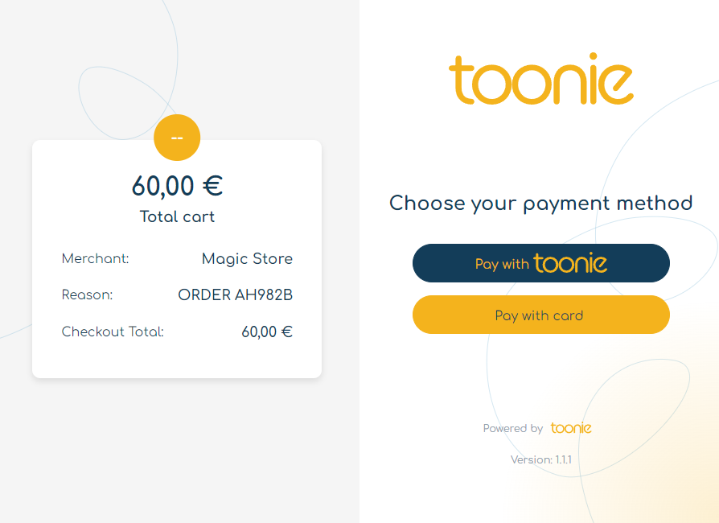
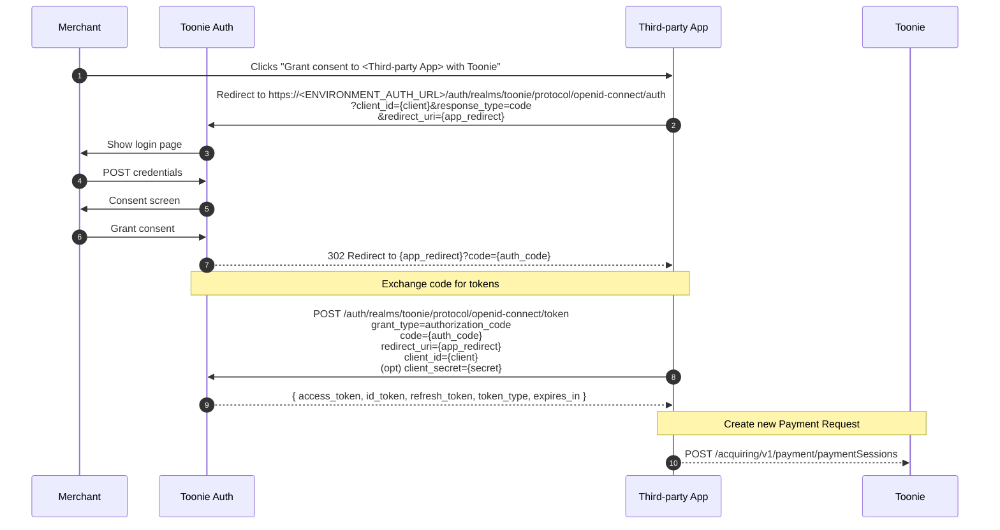
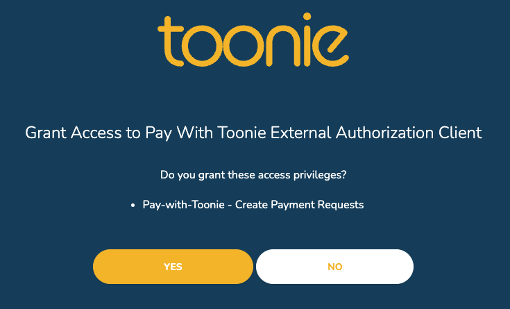

# Introduction
This constitutes the official documentation of the "Pay with Toonie" acquiring solution.

This guide will allow you to integrate your stores and ecommerces with Toonie's acquiring service in just three simple steps, facilitated by our **Pay-with-Toonie Checkout** experience.



# Checkout Experience Integration

In its current implementation the integration requires just few minutes to go from 0 to fully integrated to Toonie and start receiving your first payment.

The current flow relies on just one simple API call to setup your payment request and will take care of your customer experience until the payment is completed!

The Checkout Experience will allow you to acquire payments in just four steps:

1. Authentication
2. Payment Session Creation
3. Customer Checkout Redirection
4. Validate Payment Status


## 1. Authentication

We provide two ways of authenticating against our services, depending on the security constraints your platform offers:
- OIDC Consent Flow - Authorise a platform to create payment sessions on your behalf and limit the authorization capabilities only to managing Payment Sessions
- Username and Password - If you are in full control of your credentials/secrets and want to provide your integration global access to your Toonie account

> [!WARNING]  
> As already stated above, a token generated with the "Username and Password" integration **grants full access to your Toonie account, including withdraw and payment execution capabilities**.  
> We suggest to implement the "OIDC Consent Flow" whenever possible and we reserve the right to discontinue this feature in the future in the interest of our customers.

### 1.a (Preferred) - OIDC Consent Flow - Third Party App

With the OIDC Consent Flow the objective is to allow the merchant to authorise an External App to create Payment Requests on their behalf.

Here below a sample authentication flow.



In order to initiate the procedure, as highlighted in the diagram by point 2, the Third-party App has to be granted consent to operate on behalf of the merchant.
In order to kick off the flow, it has to redirect the merchant to the captive portal managed by Toonie Auth at this URL:
```
https://<ENVIRONMENT_AUTH_URL>/auth/realms/toonie/protocol/openid-connect/auth?client_id=<ENVIRONMENT_CLIENT_ID>&response_type=code&redirect_uri={app_redirect_url}
```
Once there, the merchant will be presented with two screens in sequence, asking to Login and then confirmation to grant access to the third party platform:  
  


The merchant will then be redirected to the `redirect_uri` at which Third-party App should capture `code` from the querystring paramters.
Assuming a `redirect_uri = 'https://www.portit.io/consent_callback'` here's where the merchant browser will be redirected on successful authorization:
```
https://www.portit.io/consent_callback/?session_state=e7a5a0b4-c8f2-4928-bab4-c165d873d7fa&code=78ee2b17-e1fb-499e-95df-843a460e599c.e7a5a0b4-c8f2-4928-bab4-c165d873d7fa.49a2bed4-af11-4e07-b0bf-7528eb9d4440
```
and to something similar to the following in case of consent denied:
```
https://www.portit.io/consent_callback/?error=access_denied&zx=1747845871743&no_sw_cr=1
```

Here is an example on how to obtain the tokens pair via the `code` that is received as part of the QueryString parameters received at the Redirect URI location/endpoint.

```js
// Auth to get token
const tokenRes = await fetch("https://<ENVIRONMENT_AUTH_URL>/auth/realms/toonie/protocol/openid-connect/token", {
    method: "POST",
    headers: {
        "content-type": "application/x-www-form-urlencoded",
    },
    body: new URLSearchParams({
        "grant_type": "authorization_code",
        "client_id": "<ENVIRONMENT_CLIENT_ID>",
        "client_secret": "<ENVIRONMENT_CLIENT_SECRET>", // OPTIONAL
        "code": "{code from querystring parameters}"
    })
});
```

This will return an Access Token that will have to be added to the Payment Session Creation request headers and a refresh token that will be used on Access Token expiry to obtain a new valid one.

> [!NOTE]
> When granted consent, the Third-party App should be able to fully function by just handling refresh and access tokens, without any further merchant interaction.


### 1.b Username and Password Flow

> [!CAUTION]
> This method grants full access to the merchant account. It should only be used in trusted, secure environments.
> Whenever possible, prefer the OIDC Consent Flow.

The Username and Password Flow will use the standard OAuth2.0 password flow to obtain the tokens pair.


```mermaid
sequenceDiagram
    autonumber
    participant App as Merchant App
    participant Keycloak as Toonie Auth
    participant Toonie as Toonie

    App->>Keycloak: POST /auth/realms/toonie/protocol/openid-connect/token<br/>grant_type=password<br/>client_id={client}<br/>username={merchant_username}<br/>password={merchant_password}
    Keycloak-->>App: { access_token, refresh_token, token_type, expires_in }

    Note over App,Toonie: Create new Payment Request
    App-->>Toonie: POST /acquiring/v1/payment/paymentSessions
 ```

The code below shows how to obtain the access token using the username and password flow.

```js
// Auth to get token
const tokenRes = await fetch("https://<ENVIRONMENT_AUTH_URL>/auth/realms/toonie/protocol/openid-connect/token", {
    method: "POST",
    headers: {
        "content-type": "application/x-www-form-urlencoded",
    },
    body: new URLSearchParams({
        "grant_type": "password",
        "client_id": "<ENVIRONMENT_CLIENT_ID>",
        "username": "<MERCHANT_USERNAME>",
        "password": "<MERCHANT_PASSWORD>",
    })
});
```

This will return an Access Token with **full access in your account**.

## 2. Payment Session Creation

To complete the initialization of a new payment session you need to call the endpoint to create it, passing some parameters like an amount, a currency and a reason.

You also need to pass a success and an error url parameters where the user will be sent after the payment.

> [!TIP]
> You can use the `{PAYMENT_SESSION_ID}` placeholder anywhere in your URLs or query string: it will be replaced with the right value by our systems.
>
> e.g. `https://myecommerce.com/payments/{PAYMENT_SESSION_ID}/ok` will be translated to `https://myecommerce.com/payments/ABCDEFG/ok`


```js
// Create a payment session
const createPaymentSession = async (amount, currency, reason) => {
  const tokenData = await getTokenData();

  const res = await fetch("https://<ENVIRONMENT_API_URL>/acquiring/v1/payment", {
    method: "POST",
    headers: {
      Authorization: `Bearer ${tokenData.access_token}`,
      "content-type": "application/json",
    },
    body: JSON.stringify({
      "amount": amount,
      "currency": currency,
      "reason": reason,
      "successUrl": "<SUCCESS_PAGE_URL>",
      "errorUrl": "<ERROR_PAGE_URL>",
    })
  })

  const data = await res.json();

  return {
      paymentSessionId: data.sessionId,
      status: data.status,
      amount: data.amount,
      currency: data.currency,
      successUrl: data.successUrl,
      errorUrl: data.errorUrl,
      reason: data.reason,
      merchantDisplayName: data.displayName,
      providers: data.selectedProviders
  };
};
```

## 3. Customer Checkout Redirection

Once obtained a Payment Session ID, you will just need to redirect your customer at the following URL:
```
https://<CHECKOUT_APP_URL>/?orderId={PAYMENT_SESSION_ID}
```

Example:
```
https://pay.toonieglobal.com/?orderId=ABCDEFG
```

The Toonie Checkout experience will then guide your customer to payment completion, redirecting them back to the specified success/failure URLs accordingly at the end of the process.

## 4. Validate Payment Status

Although your system has received a callback to the success callback you configured, you should always validate the status of the payment session.

To validate the payment status you can call the endpoint to retrieve the payment session. 
It return a single payment based on its ID:

```javascript
const getPaymentSession = async (sessionId) => {
  const tokenData = await getTokenData(); // Reuse token logic from the authentication step

  const res = await fetch(`https://<ENVIRONMENT_API_URL>/acquiring/v1/payment/paymentSession/${sessionId}`, {
    method: "GET",
    headers: {
      Authorization: `Bearer ${tokenData.access_token}`,
      "content-type": "application/json",
    },
  });

  if (!res.ok) {
    throw new Error("Failed to retrieve payment session");
  }

  const data = await res.json();

  return {
      paymentSessionId: data.sessionId,
      status: data.status,
      amount: data.amount,
      currency: data.currency,
      reason: data.reason,
      successUrl: data.successUrl,
      errorUrl: data.errorUrl,
      merchantDisplayName: data.displayName,
      providers: data.selectedProviders,
      createdAt: data.created,
      lastUpdated: data.last_updated
  };
};
```

At the payment session you can check the status of the payment, the amount, the currency and the reason.

Check the status, if the status is `COMPLETED` you can consider the payment as successful.

The payment contains some status, where we will cover the most important ones:

- `COMPLETED`: The payment was successful and the funds have been transferred to your account. Thus, you can proceed with the order.
- `FAILED`: The payment was unsuccessful and the funds were not transferred.


## Congratulations!
You have just completed your integration with Toonie and are now ready to acquire payments from your customers!

## Professional Services
Would you like us to integrate the solution in your ecommerce on your behalf or assist you during the integration, with a dedicated support team and direct access to our engineering team?

Get in touch with us at: <support@toonieglobal.com>


## SDK Integration
Do you have the right technical expertise and you would like to integrate and customise the experience within your website without making use of our Checkout platform?  
Here you can find our [JavaScript SDK](https://github.com/portittech/pay-with-toonie-js-sdk) and its [Documentation](SDK-INTEGRATION.md)!

In case you would want to delve further and try a full implementation, you can check out our [examples folder](samples/full_example)!

## Browsable API Specification
You can find an interactive API Specification here below, generated straight from our OpenAPI endpoints:
- [Pay With Toonie API](https://portitpaywithtoonie.docs.apiary.io/)

## Endpoints

### PROD


| Environment Variable       | Value                                                                   |
|----------------------------|-------------------------------------------------------------------------|
| `ENVIRONMENT_AUTH_URL`     | `https://auth.toonieglobal.com`                                         |
| `ENVIRONMENT_API_URL`      | `https://api.toonieglobal.com`                                          |
| `CHECKOUT_APP_URL`         | `https://pay.toonieglobal.com/?orderId={PAYMENT_SESSION_ID}`            |
| `ENVIRONMENT_CLIENT_ID`    | `paywithtoonie-ext-client` or assigned by your integration manager      |
| `ENVIRONMENT_CLIENT_SECRET`| Optional or assigned by your integration manager      |


## QA section

### 1. Can I get all the PaymentSessions?

Yes, you can. To check the status of all your payments, you can call the following endpoint, where you can list all the payment sessions created by your merchant account.

```js

const listPaymentSessions = async () => {
  const tokenData = await getTokenData(); // Reuse token logic from the authentication step

  const res = await fetch("https://<ENVIRONMENT_API_URL>/acquiring/v1/payment/paymentSessions", {
    method: "GET",
    headers: {
      Authorization: `Bearer ${tokenData.access_token}`,
      "content-type": "application/json",
    },
  });

  if (!res.ok) {
    throw new Error("Failed to list payment sessions");
  }

  const data = await res.json();

  return data.payments.map((session) => ({
      paymentSessionId: data.sessionId,
      status: data.status,
      amount: data.amount,
      currency: data.currency,
      reason: data.reason,
      successUrl: data.successUrl,
      errorUrl: data.errorUrl,
      merchantDisplayName: data.displayName,
      providers: data.selectedProviders,
      createdAt: data.created,
      lastUpdated: data.last_updated
  }));
};
```
This returns a list of all the payment sessions created by your merchant account, where you can filter and define the order to show them.

| Parameter                | Description                                                                                              |
|--------------------------|----------------------------------------------------------------------------------------------------------|
| `status`                 | Optional filter to list only sessions matching a specific status (e.g., `INITIATED`, `SUCCEEDED`, `CREATED`). |
| `page`                   | Page index for pagination (e.g., `0`, `1`, `2`, ...).                                                    |
| `size`                   | Number of results per page.                                                                             |
| `order`                  | Field name used for sorting results (e.g., `creationDate`, `status`, `amount`).                         |
| `orderType`              | Sorting direction: must be one of `asc` (default) or `desc`.                                            |
