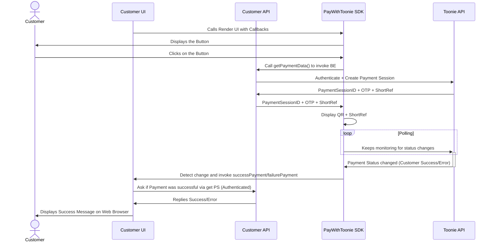

## Introduction
This constitutes the official documentation of the "Pay with Toonie" online payments solution.

In its current implementation the integration is composed of two different implementations, both required:
- **REST API**: Authenticated Serverside integration to initiate the Payment Session to be passed to the client-side application
- **Vanilla JS SDK**: Client-side integration of the "Pay with Toonie Button" User Experience, able to handle QR generation, polling and communication with the payment API.

  

## The Flow

## REST API Integration

### Authentication
In order to initialize a new payment session, it is necessary to perform a very basic integration to Toonie's Authentication endpoint.


```js
// Auth to get token
const tokenRes = await fetch('https://<ENVIRONMENT_AUTH_URL>/auth/realms/toonie/protocol/openid-connect/token', {
    method: 'POST',
    headers: {
        'Content-Type': 'application/x-www-form-urlencoded',
    },
    body: new URLSearchParams({
        "grant_type": "password",
        "client_id": "pay-with-toonie",
        "username": "customerusername",
        "password": "customerpassword",
    })
});
```

In this first version of the integration, the only supported authentication method is `username/password`.

>*Note: Authentication via a combination of `APIKey/APISecret` is currently being developed.*

### Browsable API Specification
You can find an interactive API Specification here below:
- [Pay With Toonie API](https://portitpaywithtoonie.docs.apiary.io)
- _Wallets API - Public Documentation Coming Soon_

### Endpoints

#### **DEMO**
ENVIRONMENT_AUTH_URL: _please get in touch with one of our representatives_  
ENVIRONMENT_API_URL: _please get in touch with one of our representatives_

#### **PROD**
ENVIRONMENT_AUTH_URL: `https://auth.toonieglobal.com`  
ENVIRONMENT_API_URL: `https://api.toonieglobal.com`


## JS SDK Integration

Pay With Toonie JS SDK package url: https://link-to-npm-package-here)  
Pay With Toonie JS SDK javascript component: https://link-to-npm-package-here/...js)  
Pay With Toonie JS SDK css styles: https://link-to-npm-package-here/...css)

### Steps
1. Import pay-with-toonie script and css files using the CDN/Package above. You can modify styles using `classNames`
2. Add a place where the button should be shown. ex. `<div id='my-example'></div>`
3. Call the `renderPayWithToonie` method. ex. `renderPayWithToonie(document.querySelector("#my-example"), options)`


`options` is an object with 3 parameters:
* `getPaymentData` is an async function where the create payment session should be called (Authenticated), and should return `paymentShortReference`, `otp` and `paymentSessionID`
* `successPaymentCallback: (data) => void` - (optional)
* `failurePaymentCallback: (error: Error) => void` - (optional)


## Roadmap
Here below some of the key aspects that have been insert in the product roadmap.

- [x] MVP Release - QR Code Scan-to-pay
- [ ] Short Reference Payment
- [ ] APIKey/APISecret Authentication Method
- [ ] Clientside-only JS Integration (No API Integration Required)
- [ ] Component Templating
- [ ] E-commerce platforms plugin/integration


## Complete Self contained JS Snippet

This snippet is performing what would normally be done serverside and clientside to just show a full implementation of the service.
  
>**⚠️WARNING: NEVER perform any authentication towards Toonie's API on a Single Page Application or on any client-side app⚠️**

The Full Example can be found [here](/samples/full_example/)

`full_example.htm`
```html
<html>
    <head>
        <link rel="stylesheet" href="https://path.to.build.script.css">
        <script src="https://path.to.build.script.js"></script>
        <script src="init.js"></script>
    </head>

    <body>
        <div>
            <div id="toonie-button"></div>
        </div>
    </body>
</html>
```

`full_example.js`
```js
const getPaymentData = async() => {
        
    // Auth to get token
    // ATTENTION: MAKE SURE NOT TO INCLUDE THIS AUTHENTICATION SNIPPET IN YOUR CLIENTSIDE APPLICATION
    // THIS HAS BEEN DONE FOR DEMONSTRATION PURPOSES ONLY!!!!
    const tokenRes = await fetch('https://<ENVIRONMENT_AUTH_URL>/auth/realms/toonie/protocol/openid-connect/token', {
        method: 'POST',
        headers: {
            'Content-Type': 'application/x-www-form-urlencoded',
        },
        body: new URLSearchParams({
            "grant_type": "password",
            "client_id": "pay-with-toonie",
            "username": "customerusername",
            "password": "customerpassword",
        })
    });

    const tokenData = await tokenRes.json()

        //Create payment intent
    const res  = await fetch('https://<ENVIRONMENT_API_URL>/offers/v1/payments', {
        method: 'POST',
        headers: {
            Authorization: ` Bearer ${tokenData.access_token}`,
            "content-type": "application/json",
        },
        body: JSON.stringify({
            "amount": "0.05",
            "reason": "Test Payment 01",
            "destinationWalletId": "<MERCHANTWALLETID>",
            "transactionCurrency": "EUR"
        })
    })

    const data = await res.json()
    
    // Data to be consumed by the SDK
    return { 
        paymentSessionId: data.paymentSessionId,
        otp: data.otp,
        paymentShortReference: data.shortReference
        }
    };

const failurePaymentCallback = (err) => {
    console.log('userError', err)
}

renderPayWithToonie(document.querySelector("#toonie-button"), { getPaymentData, failurePaymentCallback })
```