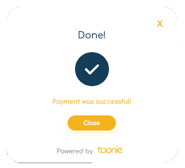

## Introduction
This constitutes the official documentation of the "Pay with Toonie" online payments solution.

You can see and try a full implementation example using the file in [full_example](samples/full_example) folder




## REST API Integration

### Authentication

In its current implementation the integration requires an Authenticated Serverside integration to initiate the Payment Session to be passed to the client-side application.
In order to initialize a new payment session, it is necessary to perform a very basic integration to an Authentication endpoint.

```js
// Auth to get token
const tokenRes = await fetch("https://<ENVIRONMENT_AUTH_URL>/auth/realms/toonie/protocol/openid-connect/token", {
    method: "POST",
    headers: {
        "content-type": "application/x-www-form-urlencoded",
    },
    body: new URLSearchParams({
        "grant_type": "password",
        "client_id": "paywithtoonie-client",
        "username": "customerusername",
        "password": "customerpassword",
    })
});
```

In this first version of the integration, the only supported authentication method is `username/password`.

>*Note: Authentication via a combination of `APIKey/APISecret` is currently being developed.*

### Payment Session Initialization

To complete the initialization of a new payment session you need to call the endpoint to create it, passing some parameters like an amount, a currency and a reason.

You also need to pass a success and an error url parameters where the user will be sent after the payment.

You can use the `{PAYMENT_SESSION_ID}` placeholder anywhere in your url, it will be replaced in our system with the right value.

```js
// Create a payment session
const createPaymentSession = async (amount, currency, reason) => {
  const tokenData = await getTokenData();

  const res = await fetch("https://<ENVIRONMENT_API_URL>/acquiring/v1/payment", {
    method: "POST",
    headers: {
      Authorization: `Bearer ${tokenData.access_token}`,
      "content-type": "application/json",
    },
    body: JSON.stringify({
      "amount": amount,
      "currency": currency,
      "reason": reason,
      "successUrl": "<SUCCESS_PAGE_URL>",
      "errorUrl": "<ERROR_PAGE_URL>",
    })
  })

  const data = await res.json();

  // Data to be consumed by the SDK
  return {
    paymentSessionId: data.sessionId,
    amount: data.amount,
    currency: data.currency,
    successUrl: data.successUrl,
    errorUrl: data.errorUrl,
    reason: data.reason,
    otp: data.otp,
    paymentShortReference: data.shortReference,
    displayName: data.displayName,
  };
};
```

### Browsable API Specification
You can find an interactive API Specification here below:
- [Pay With Toonie API](https://pwtdraft.docs.apiary.io/#)
- _Wallets API - Public Documentation Coming Soon_

### Endpoints

#### **DEMO**
ENVIRONMENT_AUTH_URL: _please get in touch with one of our representatives_  
ENVIRONMENT_API_URL: _please get in touch with one of our representatives_

#### **PROD**
ENVIRONMENT_AUTH_URL: `https://auth.toonieglobal.com`  
ENVIRONMENT_API_URL: `https://api.toonieglobal.com`