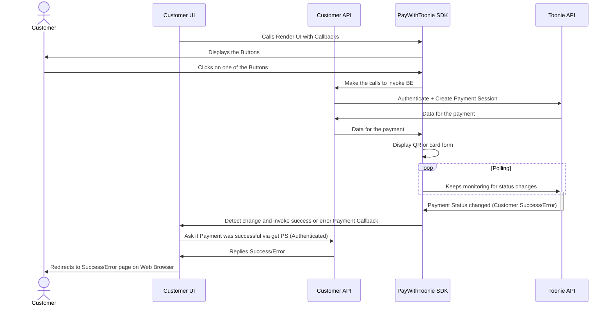

## The Flow



## JS SDK Integration

The official repository can be found in this location:
https://github.com/portittech/pay-with-toonie-js-sdk

Packages can be found at this location: https://www.npmjs.com/package/@portittech/pay-with-toonie

- Pay With Toonie JS SDK [npm package url](https://www.npmjs.com/package/@portittech/pay-with-toonie)
- Pay With Toonie JS SDK [component](https://unpkg.com/@portittech/pay-with-toonie/dist/pay-with-toonie.dist.js)
- Pay With Toonie JS SDK [CSS styles](https://unpkg.com/@portittech/pay-with-toonie/dist/pay-with-toonie.dist.css)

### Steps
1. Import pay-with-toonie script and css files using the CDN/Package above. You can modify styles using `classNames`
2. Add a place where the buttons should be shown. ex. `<div id='my-example'></div>`
3. Call the `renderPayWithToonie` method. ex. `renderPayWithToonie(document.querySelector("#my-example"), options)`


`options` is an object with the following properties:
* `getTokenData` is an async function to authenticate the next calls
* `createPaymentSession` is an async function where the creation of the payment session should be called (Authenticated)
* `fetchPaymentDataBySessionId` is an async function to get info about the payment session by its id
* `initiatePayment` is an async function to create a new payment, giving it data about it
* `updatePayment` is an async function to update the status of a payment
* `approveCardPayment(paymentId)` is an async function which should accept a `paymentId` parameter and make a call to accept and confirm the payment, passing the `currency` of the merchant who will receive the payment
* `createStreamPaymentIntent` is an async function which creates a payment intent for a stream payment
* `approveStreamPayment` is an async function which accepts a `paymentIntentStreamId` parameter and changes the status of the intent to `APPROVED`
* `rejectStreamPayment` is an async function which accepts a `paymentIntentStreamId` parameter and changes the status of the intent to `REJECTED`
* `fetchStreamPaymentIntent` is an async function which accepts a `paymentIntentStreamId` parameter and fetch information about a stream payment intent
* `onModalClose: (error) => void` - (optional) callback to perform an action on the payment modal closure
* `successPaymentCallback: (data) => void` - (optional)
* `failurePaymentCallback: (error: Error) => void` - (optional)
* `genericErrorCallback: (error: Error) => void` - (optional)
* `baseUrl` - absolute path from which to start API endpoints
* `renderPayWithToonieButton: boolean` - choose to render or not the Pay With Toonie Button
* `renderStreamWithToonieButton: boolean` - choose to render or not the Stream With Toonie Button
* `renderPayWithCardButton: boolean` - choose to render or not the Pay With Card Button


## Roadmap
Here below some of the key aspects that have been insert in the product roadmap.

- [x] MVP Release - QR Code Scan-to-pay
- [ ] Short Reference Payment
- [ ] APIKey/APISecret Authentication Method
- [ ] Clientside-only JS Integration (No API Integration Required)
- [ ] Component Templating
- [ ] E-commerce platforms plugin/integration


## Complete Self contained JS Snippet

This snippet is performing what would normally be done serverside and clientside to just show a full implementation of the service.
  
>**⚠️WARNING: NEVER perform any authentication towards our API on a Single Page Application or on any client-side app⚠️**

The Full Example can be found [here](/samples/full_example/)

`full_example.htm`
```html
<html>
    <head>
        <link rel="stylesheet" href="https://unpkg.com/@portittech/pay-with-toonie/dist/pay-with-toonie.dist.css">
        <script src="https://unpkg.com/@portittech/pay-with-toonie/dist/pay-with-toonie.dist.js"></script>
        <script src="full_script.js"></script>
    </head>

    <body>
        <div>
            <div id="toonie-button"></div>
        </div>
    </body>
</html>
```

`full_example.js`
```js
const getTokenData = async () => {
  // Auth to get token
  // ATTENTION: MAKE SURE NOT TO INCLUDE THIS AUTHENTICATION SNIPPET IN YOUR CLIENTSIDE APPLICATION
  // THIS HAS BEEN DONE FOR DEMONSTRATION PURPOSES ONLY!!!!
  const tokenRes = await fetch(
    "https://<ENVIRONMENT_AUTH_URL>/auth/realms/toonie/protocol/openid-connect/token",
    {
      method: "POST",
      headers: {
        "Content-Type": "application/x-www-form-urlencoded",
      },
      body: new URLSearchParams({
        grant_type: "password",
        client_id: "pay-with-toonie",
        username: "customerusername",
        password: "customerpassword",
      }),
    }
  );

  return await tokenRes.json();
}

/**
 * PAYMENT CREATION
 */

const createPaymentSession = async (amount, currency, reason) => {
  const tokenData = await getTokenData();

  const res = await fetch("https://<ENVIRONMENT_API_URL>/acquiring/v1/payment", {
    method: "POST",
    headers: {
      Authorization: ` Bearer ${tokenData.access_token}`,
      "content-type": "application/json",
    },
    body: JSON.stringify({
      amount: amount ?? "1.23",
      currency: currency ?? "EUR",
      reason: reason ?? "Test Payment 01",
      successUrl: "https://www.yourdomain.com/success",
      errorUrl: "https://www.yourdomain.com/error",
    }),
  });

  const data = await res.json();

  // Data to be consumed by the SDK
  return {
    paymentSessionId: data.sessionId,
    amount: data.amount,
    currency: data.currency,
    successUrl: data.successUrl,
    errorUrl: data.errorUrl,
    reason: data.reason,
    otp: data.otp,
    paymentShortReference: data.shortReference,
  };
};

// GET PAYMENT DATA BY SESSION ID
const fetchPaymentDataBySessionId = async (paymentSessionId) => {
  const tokenData = await getTokenData();

  const res = await fetch(`https://<ENVIRONMENT_API_URL>/acquiring/v1/payment/${paymentSessionId}`, {
    method: 'GET',
    headers: {
      Authorization: `Bearer ${tokenData.access_token}`,
      "content-type": "application/json",
    },
  })

  const data = await res.json()

  return {
    paymentSessionId: data.sessionId,
    amount: data.amount,
    currency: data.currency,
    reason: data.reason,
    successUrl: data.successUrl,
    errorUrl: data.errorUrl,
  }
}

// INITIATE A PAYMENT
const initiatePayment = async (paymentSessionId, amount, currency, provider, reason) => {
  const tokenData = await getTokenData();

  const res = await fetch("https://<ENVIRONMENT_API_URL>/acquiring/v1/payment/initiate", {
    method: 'POST',
    headers: {
      Authorization: `Bearer ${tokenData.access_token}`,
      "content-type": "application/json",
    },
    body: JSON.stringify({
      paymentSessionId: paymentSessionId,
      amount: amount ?? "1.23",
      currency: currency ?? "EUR",
      walletId: "<WALLET_ID>",
      reason: reason ?? "Initiate payment 01",
      provider: provider,
      paymentSessionRequest: {
        amount: amount ?? "1.23",
        reason: reason ?? "Initiate payment 01",
        destinationWalletId: "<WALLET_ID>",
        transactionCurrency: currency ?? "EUR",
      }
    }),
  });

  const data = await res.json();

  return {
    amount: data.amount,
    currency: data.currency,
    reason: data.reason,
    clientSecret: data.clientSecret,
    stripePaymentIntentId: data.paymentIntentId,
    feeAmount: data.feeAmount,
    otp: data.provider.otp,
    offersSessionId: data.provider.paymentOfferSessionId,
    paymentShortReference: data.provider.shortReference,
  };
}

// UPDATE PAYMENT
const updatePayment = async (paymentSessionId, paymentStatus) => {
  const tokenData = await getTokenData();

  return await fetch("https://<ENVIRONMENT_API_URL>/acquiring/v1/payment/${paymentSessionId}/status/${paymentStatus}", {
    method: 'PUT',
    headers: {
      Authorization: `Bearer ${tokenData.access_token}`,
      "content-type": "application/json",
    }
  });
}

/**
 * PAYMENT BY CARD CALLBACKS
 */

const approveCardPayment = async (paymentId) => {
  const tokenData = await getTokenData();

  return await fetch(`https://<ENVIRONMENT_API_URL>/acquiring/v1/card/${paymentId}/approve`, {
    method: 'POST',
    headers: {
      Authorization: `Bearer ${tokenData.access_token}`,
      "content-type": "application/json",
    },
    body: JSON.stringify({
      amount: "1.1",
      walletId: "<MERCHANTWALLETID>",
      currency: "EUR",
    }),
  });
}

/**
 * STREAM WITH TOONIE CALLBACKS
 */

const createStreamPaymentIntent = async () => {
  const tokenData = await getTokenData();

  const res = await fetch('https://<ENVIRONMENT_API_URL>/acquiring/v1/stream', {
    method: 'POST',
    headers: {
      Authorization: `Bearer ${tokenData.access_token}`,
      "content-type": "application/json",
    },
    body: JSON.stringify({
      amount: "1.12",
      currency: "EUR",
      walletId: "<MERCHANTWALLETID>",
      type: "Stream",
    })
  })

  const data = await res.json()

  return {
    paymentIntentStreamId: data.paymentIntentStreamId,
    amount: data.amount,
    currency: data.currency,
    walletId: data.walletId,
    reason: data.reason,
  }
};

const approveStreamPayment = async (paymentIntentStreamId) => {
  const tokenData = await getTokenData();

  return await fetch(`https://<ENVIRONMENT_API_URL>/acquiring/v1/stream/approve/${paymentIntentStreamId}`, {
    method: 'PUT',
    headers: {
      Authorization: `Bearer ${tokenData.access_token}`,
      "content-type": "application/json",
    },
  });
}

const rejectStreamPayment = async (paymentIntentStreamId) => {
  const tokenData = await getTokenData();

  return await fetch(`https://<ENVIRONMENT_API_URL>/acquiring/v1/stream/reject/${paymentIntentStreamId}`, {
    method: 'PUT',
    headers: {
      Authorization: `Bearer ${tokenData.access_token}`,
      "content-type": "application/json",
    },
  });
}

const fetchStreamPaymentIntent = async (paymentIntentStreamId) => {
  const tokenData = await getTokenData();

  return await fetch(`https://<ENVIRONMENT_API_URL>/acquiring/v1/stream/${paymentIntentStreamId}`, {
    method: 'GET',
    headers: {
      Authorization: `Bearer ${tokenData.access_token}`,
      "content-type": "application/json",
    }
  });
}

/**
 * RESULT CALLBACKS
 */

const successPaymentCallback = (data) => {
    console.log('Success!!', data)
}

const failurePaymentCallback = (err) => {
    console.error('userError', err)
}

const genericErrorCallback = error => {
  console.error("Error!!", error);
};

const onModalClose = possiblePaymentStatusInError => {
  if (possiblePaymentStatusInError)
    console.error(possiblePaymentStatusInError);
};

const baseUrl = "https://<ENVIRONMENT_API_URL>";

// CHOOSE WHICH BUTTONS TO RENDER
const renderPayWithToonieButton = true;
const renderStreamWithToonieButton = true;
const renderPayWithCardButton = true;

const options = {
  getTokenData,
  createPaymentSession,
  fetchPaymentDataBySessionId,
  initiatePayment,
  updatePayment,
  approveCardPayment,
  createStreamPaymentIntent,
  approveStreamPayment,
  rejectStreamPayment,
  fetchStreamPaymentIntent,
  successPaymentCallback,
  failurePaymentCallback,
  genericErrorCallback,
  onModalClose,
  baseUrl,
  renderPayWithToonieButton,
  renderStreamWithToonieButton,
  renderPayWithCardButton,
}

// builds the UI for the form
PayWithToonie.render(document.querySelector("#toonie-button"), options);
```